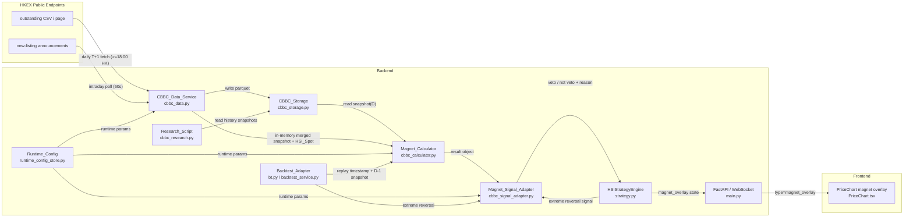
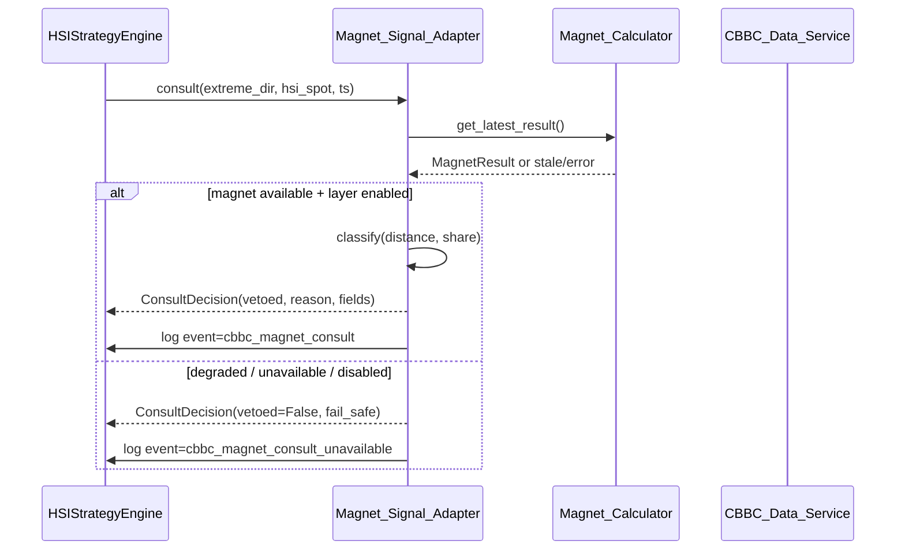
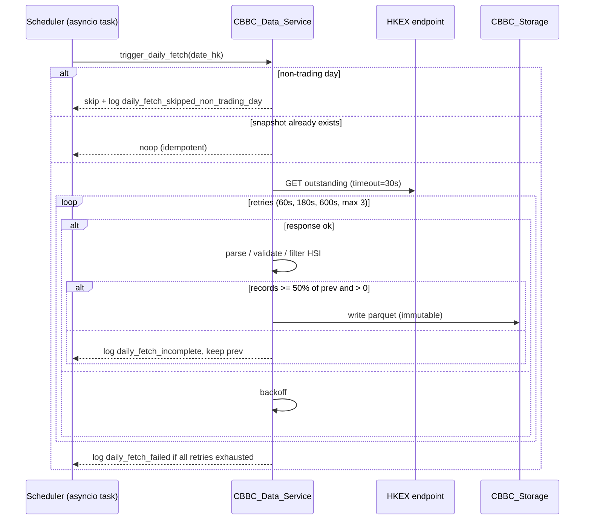

# Design Document

## Overview

CBBC 街货磁吸信号层（cbbc-magnet-signal）在 `HSIStrategyEngine` 的 **extreme** 反转入场分支前增加一个**方向加分 / 否决层**。它不新增独立入场分支，也不修改 normal、momentum、cum_trend、rsi_divergence 这四类既有分支的判定。

本设计的核心是把 HKEX 公开的 CBBC outstanding（每日 T+1 收市后）与盘中新发上市公告聚合成一个简单可解释的标量 `Magnet_Bias ∈ [-1, 1]`，以及最近的 bull / bear 方向 Call_Level 距离。当 extreme 反转方向直接撞向密集街货带（且该带的 dollar-weighted 占比足够大）时否决该入场；当反转方向与磁吸背离时维持原入场逻辑。

模块以"先观察后启用"为原则：
- 默认 `cbbc_magnet_layer_enabled=False`，对实盘策略零侵入；
- 提供 `backend/cbbc_research.py` 离线研究脚本，要求至少 60 个港股交易日的统计证据后再由人工切换启用；
- 任何抓取 / 解析 / 计算异常都进入 fail-safe（不否决，不阻塞主策略循环）；
- 完整支持 `bt.py` 历史回放，避免生存偏差。

模块严格遵循公开数据合规边界：仅访问 HKEX 域名白名单 `{www.hkex.com.hk, www1.hkexnews.hk}`，绝不在持久化、日志、前端推送中包含账户 / 订单 / 持仓 / 盈亏字段。

## Architecture

### Component Layout

模块代码全部位于 `backend/` 下，新增以下文件，并对若干现有文件进行扩展（不破坏现有 API 形态）：

新增：
- `backend/cbbc_data.py`：HKEX 抓取、解析、持久化（含每日 + 盘中合并）；包含白名单守卫、限频器、退避重试。
- `backend/cbbc_calculator.py`：纯函数式磁吸量化计算（无 I/O）。
- `backend/cbbc_signal_adapter.py`：与 `HSIStrategyEngine.extreme` 分支咨询的胶水层。
- `backend/cbbc_storage.py`：CBBC_Snapshot 文件读写、生存偏差守卫、错误码。
- `backend/cbbc_research.py`：离线研究脚本（CLI 入口）。
- `backend/data/cbbc/`：snapshot 持久化目录（运行时按需创建）。
- `backend/research/`：研究输出目录（运行时按需创建）。
- 测试：`backend/test_cbbc_data.py`、`backend/test_cbbc_calculator.py`、`backend/test_cbbc_signal_adapter.py`、`backend/test_cbbc_storage.py`、`backend/test_cbbc_research.py`、`backend/test_cbbc_backtest_adapter.py`。

修改：
- `backend/runtime_config_store.py`：新增 6 个 CBBC 字段（默认值 + 区间校验）。
- `backend/strategy.py::HSIStrategyEngine`：在 `run_strategy_check` 的 extreme 分支信号点接入 `Magnet_Signal_Adapter`；在 `_runtime_config_payload` / `_load_runtime_config` 中应用持久化的 CBBC 参数；扩展 `StrategyState` 暴露 `cbbc_magnet_degraded` 与最近一次 consult 摘要。
- `backend/models.py`：扩展 `StrategyState`、`ConfigResponse`、`ConfigUpdate` 以暴露 CBBC 字段；新增 `MagnetOverlayPayload`、`MagnetConsultRecord` 等模型。
- `backend/main.py`：在 WebSocket 推送中新增 `type=magnet_overlay`；在 `/api/state` 返回中带上 magnet 状态；在 CBBC_Data_Service 启动 / 停止上挂到 FastAPI lifespan。
- `backend/bt.py` 与 `backend/backtest_service.py`：通过 `Backtest_Adapter` 调用同一份 `Magnet_Calculator` 与 `Magnet_Signal_Adapter` 完成回测期 magnet 否决。
- `frontend/src/components/PriceChart.tsx`：新增磁吸水平线 + 密集带阴影 + 否决标记图层；`useWebSocket.ts`、`api.ts`、`types.ts` 增加新消息类型。

### Component Diagram



### Data Flow

实盘单次咨询路径（关键路径，毫秒级）：



每日抓取路径：



### Concurrency & Threading Model

- `CBBC_Data_Service` 在 `HSIStrategyEngine.start` 时挂到现有 asyncio 事件循环：
  - 每日抓取：单个 asyncio 任务，每分钟检查是否进入 18:00–23:59:59 (Asia/Hong_Kong) 抓取窗口。
  - 盘中轮询：单个 asyncio 任务，仅在 `Morning_Session` / `Afternoon_Session` 内每 `cbbc_intraday_poll_interval_seconds` 触发一次。
- `Magnet_Calculator` 是无状态纯函数 + 一个原子可读的 `MagnetResult` 容器（用 `asyncio.Lock` 串行化 publish）。
- `Magnet_Signal_Adapter` 的 `consult()` 是同步函数，从最近一次 `MagnetResult` 快照读取（不会阻塞主策略循环）。
- 所有 HKEX 请求通过统一的 `RateLimitedClient`（60 秒窗口 6 次上限），且在白名单守卫之后才发出实际请求。

## Components and Interfaces

### CBBC_Data_Service (`cbbc_data.py`)

职责：HKEX 抓取调度、白名单守卫、限频、解析、持久化触发、盘中合并。

关键接口（部分异步）：

```python
class CbbcDataService:
    def __init__(self, *, storage: CbbcStorage, config: RuntimeConfig, clock: ClockProtocol, http: RateLimitedClient): ...

    async def start(self) -> None: ...   # 启动每日 + 盘中两个任务
    async def stop(self) -> None: ...

    # 暴露给 Magnet_Calculator / Adapter 的只读视图
    def current_snapshot(self) -> CbbcSnapshot: ...
    def last_refresh_ts_hk(self) -> datetime | None: ...
    def is_intraday_polling_suspended(self) -> bool: ...

    # 显式触发（测试 / 回测使用）
    async def trigger_daily_fetch(self, date_hk: date) -> DailyFetchOutcome: ...
    async def trigger_intraday_poll_once(self) -> IntradayPollOutcome: ...
```

`DailyFetchOutcome`：枚举 `{success, skipped_non_trading_day, skipped_already_exists, failed_retries_exhausted, incomplete_data}`，带 `records_written` / `records_dropped`。

退避重试参数（来自 R1.8）：`[60s, 180s, 600s]`，最多 3 次，单次请求超时 30s（每日）/ 10s（盘中）。

### CBBC_Storage (`cbbc_storage.py`)

职责：snapshot 文件读写、生存偏差守卫、错误码。**所有错误以异常或显式 `Result` 类型返回；外部模块的 fail-safe 由调用方负责。**

```python
@dataclass(frozen=True)
class CbbcRecord:
    issuer: str
    code: str
    call_level: float
    outstanding_shares: float
    er_ratio: float
    direction: Literal["bull", "bear"]
    listing_date: date
    maturity_date: date
    underlying: str           # 必须等于 "HSI"
    snapshot_date: date

@dataclass(frozen=True)
class CbbcSnapshot:
    snapshot_date: date
    records: tuple[CbbcRecord, ...]

class SnapshotError(Exception):
    code: Literal[
        "non_trading_day",
        "snapshot_missing",
        "snapshot_immutable",
        "no_reverse_deduction_allowed",
    ]

class CbbcStorage:
    def write_snapshot(self, snapshot: CbbcSnapshot) -> None: ...        # 不可覆盖；同名拒绝
    def read_snapshot(self, d: date) -> CbbcSnapshot: ...                # 校验交易日
    def latest_before(self, d: date) -> CbbcSnapshot | None: ...
    def list_dates(self) -> list[date]: ...
    def reject_reverse_deduction(self, *, today: date, requested: date) -> None: ...
```

存储格式：parquet，路径 `backend/data/cbbc/outstanding_YYYYMMDD.parquet`。

### Magnet_Calculator (`cbbc_calculator.py`)

纯函数 + 一个 `MagnetEngine` 包裹的最近一次结果发布器；任何 I/O 在外面完成。

```python
@dataclass(frozen=True)
class MagnetResult:
    generated_at_hk: datetime
    hsi_spot: float
    hsi_spot_stale: bool
    decay_points: float
    magnet_bias: float          # ∈ [-1.0, 1.0]
    magnet_pull_bull: float
    magnet_pull_bear: float
    histogram: tuple[HistBucket, ...]   # 5pt 桶, 距离 ≤ 200pt
    record_count: int
    skipped_count: int
    nearest_bull_distance_pts: float | None
    nearest_bear_distance_pts: float | None

def compute_magnet(snapshot: CbbcSnapshot, hsi_spot: float, decay_points: float) -> MagnetResult: ...

class MagnetEngine:
    def __init__(self, *, hsi_stale_seconds: float = 5.0): ...
    def update_hsi_spot(self, price: float, ts_hk: datetime) -> None: ...
    def update_snapshot(self, snapshot: CbbcSnapshot) -> None: ...
    def update_decay_points(self, value: float) -> None: ...   # 校验 (0, 10000]
    def latest(self) -> MagnetResult | None: ...
```

公式（与 R4 完全对齐，且 `Magnet_Bias` 截断到 `[-1, 1]`）：

```
distance_pts        = |Call_Level - HSI_Spot|
weight              = max(0, 1 - distance_pts / decay_points)
notional_hkd        = outstanding_shares * er_ratio * weight
magnet_pull_bull    = sum(notional_hkd for r where direction=bull)
magnet_pull_bear    = sum(notional_hkd for r where direction=bear)
denom               = max(magnet_pull_bull + magnet_pull_bear, 1.0)
magnet_bias         = clamp((magnet_pull_bear - magnet_pull_bull) / denom, -1.0, 1.0)
```

更新触发：当 `|new_hsi_spot - last_used_hsi_spot| > 5.0` 时，3 秒内重新发布。

### Magnet_Signal_Adapter (`cbbc_signal_adapter.py`)

```python
@dataclass(frozen=True)
class ConsultDecision:
    vetoed_by_cbbc_magnet: bool
    reason_code: Literal[
        "cbbc_dense_band_clear",
        "cbbc_dense_band_above",
        "cbbc_dense_band_below",
        "cbbc_dense_band_pull_share_below",
        "cbbc_magnet_consult_unavailable",
        "cbbc_magnet_layer_disabled",
        "cbbc_magnet_degraded",
    ]
    nearest_bull_distance_pts: float | None
    nearest_bear_distance_pts: float | None
    magnet_bias: float | None
    magnet_aligned_against_reversal: bool
    magnet_available: bool

class MagnetSignalAdapter:
    def __init__(self, *, calculator: MagnetEngine, config: RuntimeConfig, clock: ClockProtocol): ...

    def consult_for_extreme(
        self,
        extreme_direction: Literal["BULL", "BEAR"],
        hsi_spot: float,
        ts_hk: datetime,
    ) -> ConsultDecision: ...
```

判定规则（R5；与 R10 的降级互斥）：

| 状态 | 决策 |
|---|---|
| `cbbc_magnet_layer_enabled=False` | `vetoed=False`, `reason=cbbc_magnet_layer_disabled`, 不写 consult 日志 |
| 降级模式 (`cbbc_magnet_degraded=True`) | `vetoed=False`, `reason=cbbc_magnet_degraded`, 写 `cbbc_magnet_consult_unavailable` 日志 |
| HSI_Spot / Magnet_Bias / Call_Level 任一不可用，或 `pull_bull + pull_bear = 0` | `vetoed=False`, `reason=cbbc_magnet_consult_unavailable`, 写 `cbbc_magnet_consult_unavailable` 日志 |
| 反向距离 > 阈值 | `vetoed=False`, `reason=cbbc_dense_band_clear` |
| 反向距离 ≤ 阈值 且反向 pull share ≥ `cbbc_dense_band_pull_share` | `vetoed=True`, `reason=cbbc_dense_band_above`/`cbbc_dense_band_below` |
| 反向距离 ≤ 阈值 但反向 pull share 严格小于 `cbbc_dense_band_pull_share` | `vetoed=False`, `reason=cbbc_dense_band_pull_share_below` |
| 与磁吸背离（`Magnet_Bias > 0` 且 BULL；或 `Magnet_Bias < 0` 且 BEAR） | `magnet_aligned_against_reversal=True`，按以上距离规则得出最终 `vetoed`；不会因背离独立否决 |

每次正常 consult 写 1 条 `event=cbbc_magnet_consult` 结构化日志（R5.8）。

### CBBC_Data_Service ⇆ HSIStrategyEngine 集成点

`HSIStrategyEngine` 中只在以下两处接入：

1. **`__init__`**：构造 `CbbcStorage / MagnetEngine / MagnetSignalAdapter / CbbcDataService` 并把 `cbbc_*` 字段加入 `_load_runtime_config` 解析。
2. **`run_strategy_check`** 的 extreme 分支信号点（约 strategy.py:2580 后的 extreme 分支生成 `sig` 之后、调用 `_submit_entry_order` 之前）：

```python
# 伪代码
if sig and sig_mode == "extreme":
    decision = self.magnet_adapter.consult_for_extreme(
        extreme_direction=("BULL" if sig.side == PositionType.BULL else "BEAR"),
        hsi_spot=hsi_price,
        ts_hk=now_hk,
    )
    self.last_magnet_consult = decision  # 暴露给 /api/state 与 WebSocket
    if decision.vetoed_by_cbbc_magnet:
        await self._emit_strategy_disabled_skip(
            mode="extreme",
            reason=f"cbbc_magnet_veto:{decision.reason_code}",
        )
        return
```

捕获异常按 R10.6：

```python
try:
    decision = self.magnet_adapter.consult_for_extreme(...)
except Exception as exc:
    self.cbbc_magnet_degraded = True
    log.warning("cbbc_magnet uncaught exception, degrading", exc_info=exc)
    decision = ConsultDecision.fail_safe()
```

### Backtest_Adapter (`bt.py` + `backtest_service.py`)

为不破坏 `bt.py` 现有 CLI 单文件风格，新增轻量包装器 `cbbc_backtest_adapter.py`，并在 `backtest_service.run_backtest` 内部按需调用。

```python
class CbbcBacktestAdapter:
    def __init__(self, storage: CbbcStorage, runtime_cfg: RuntimeConfig, clock: ClockProtocol): ...

    def prepare_for_day(self, day: date) -> DayPreparation: ...
    # DayPreparation 包含 base_snapshot (= D-1 18:00) 与有序 intraday_new_listings

    def at_replay_ts(self, ts_hk: datetime, hsi_spot: float) -> MagnetResult | None: ...
    def consult_extreme(self, side: PositionType, hsi_spot: float, ts: datetime) -> ConsultDecision: ...

    def summary(self) -> BacktestMagnetSummary: ...
    # 字段:
    #   total_vetoed: int
    #   vetoed_dense_band_above: int
    #   vetoed_dense_band_below: int  # 即"按距离原因否决"
    #   control_total: int
    #   cbbc_snapshot_missing_days: int
```

`bt.py` 注入点（最小改动）：

```python
adapter = CbbcBacktestAdapter(...)
for day, df_day in groupby_trading_day(d1):
    prep = adapter.prepare_for_day(day)   # 缺则跳过当日 magnet
    for i, row in iterate_klines(df_day):
        adapter.at_replay_ts(ts_hk=row.time_key, hsi_spot=row.close)
        # ... 现有信号生成 ...
        if sig is extreme reversal:
            decision = adapter.consult_extreme(side, row.close, row.time_key)
            # control_total += 1 always; total_vetoed += decision.vetoed
            if decision.vetoed_by_cbbc_magnet:
                continue
        # ...
print(adapter.summary())
```

R7.5 行为：当 D-1 snapshot 不存在或读取失败时整日跳过 magnet 否决并把 `cbbc_snapshot_missing_days += 1`；只有"非快照缺失"原因（layer disabled、参数无效、降级等）才不增加该计数（R7.6）。

### Research_Script (`cbbc_research.py`)

CLI（argparse）：

```
python cbbc_research.py \
    --start-date YYYY-MM-DD \
    --end-date YYYY-MM-DD \
    --decay-points 300 \
    --dense-band-threshold-pts 150
```

执行步骤：

1. **参数校验**（R6.1, R6.11）：日期格式 `YYYY-MM-DD`，整数 `[1, 1000]`；任一失败立即在 5 秒内非零退出，写 stderr，**不创建任何输出文件**。
2. **覆盖区间**：枚举 [start, end] 间所有港股交易日。
3. **每日聚合**（R6.3, R6.4）：
   - 仅使用 `CbbcStorage.read_snapshot(D)` 与该日 09:30–16:00 的 1 分钟 HSI K 线（来自现有 `bt.py` 历史数据 / Futu）。
   - 在 15:30:00–16:00:00 (HK) 窗口内按 1 分钟采样，计算 `Magnet_Bias` 与 `nearest_dense_band_distance_pts`，取均值。
   - 当日采样数 < 5 直接丢弃。
   - 计算 `is_intraday_new_listing_near_money_day`：当日 09:30–16:00 内有新发 CBBC 且其上市时刻 `Distance_Pts <= dense_band_threshold_pts`。
4. **总体相关性**（R6.5）：当日收盘前 `Magnet_Bias` vs 次日 HSI 收盘方向（涨/跌 → ±1），输出 Pearson + Spearman（保留 4 位）+ N + p_value。
5. **新发事件分组**（R6.6）：将日切成两组 — 有 / 无 `is_intraday_new_listing_near_money_day`，分别计算次日相对当日 HSI 收盘的最大顺势点数 & 最大逆势点数（保留 2 位），输出中位数 + 75 分位数 + N。
6. **门槛检查**（R6.7）：若有效交易日 < 60，写 `level=ERROR, source=cbbc_research, event=insufficient_trading_days` 日志，**不输出最终结论**，非零退出。
7. **写文件**（R6.8, R6.9）：`backend/research/cbbc_magnet_<YYYYMMDDHHMMSS>.csv` + `.md`，文件头部包含 `decay_points`、`dense_band_threshold_pts`、`cbbc_dense_band_pull_share`、起止日期、所用 snapshot 文件清单的 SHA-256、起止时间戳（HK）。
8. **不调用** 任何切换 `cbbc_magnet_layer_enabled` 的接口（R6.10）。

### Frontend Magnet Overlay (`frontend/src/components/PriceChart.tsx`)

订阅新的 WebSocket 消息类型：

```typescript
interface MagnetOverlayPayload {
  decay_points?: number
  dense_band_pull_share: number   // 默认 0.40
  cbbc_magnet_degraded: boolean
  hsi_spot_stale: boolean
  call_levels: Array<{ code: string; direction: "bull" | "bear"; call_level: number }>
  histogram: Array<{ bucket_low: number; bucket_high: number; pull_hkd: number }>
  recent_vetoes: Array<{ kline_time: string; direction: "BULL" | "BEAR"; reason_code: string }>
}
```

绘制规则：
- 仅在 `decay_points` 字段存在且 `cbbc_magnet_degraded=false` 时绘制；任一不满足则隐藏所有水平线 / 阴影 / 否决标记，并在 PriceChart 顶部右侧显示 "CBBC 磁吸数据不可用"（R8.6）。
- 横线：`Distance_Pts <= decay_points` 的 Call_Level，宽 1px；牛证沿用 PriceChart 既有 `BULL_DOWN_COLOR`，熊证沿用 `BEAR_DOWN_COLOR`（与 PriceChart 现有常量一致，避免重复定义）。
- 密集带：每 5pt 桶的 `pull_hkd / (pull_bull + pull_bear) >= 0.15` 时，对该桶范围打不透明度 0.25 的阴影；桶内水平线宽提升至 2px（R8.4）。
- 否决标记：`recent_vetoes` 中尚未滚出可见窗口的项，在被否决 K 线时间位置上方画一个 ≥ 8px 的标记（R8.5）。
- 渲染目标：从收到 `magnet_overlay` 到画面更新 ≤ 500ms（R8.1）。

### Runtime_Config 扩展（`runtime_config_store.py` + `strategy.py`）

新增 6 个字段（合并到现有 JSON）：

| 字段 | 类型 | 默认 | 范围 |
|---|---|---|---|
| `cbbc_magnet_layer_enabled` | bool | `false` | — |
| `cbbc_intraday_polling_suspended` | bool | `false` | — |
| `cbbc_magnet_decay_points` | float | `300.0` | `(0.0, 10000.0]` |
| `cbbc_dense_band_threshold_pts` | float | `150.0` | `[10.0, 1000.0]` |
| `cbbc_dense_band_pull_share` | float | `0.40` | `[0.0, 1.0]` |
| `cbbc_intraday_poll_interval_seconds` | float | `60.0` | `[10.0, 600.0]` |

`save_runtime_config` 已经是临时文件 + 原子重命名（满足 R9.5）。新增字段在 `_load_runtime_config` 中按区间校验，无效值写 WARN 日志并回退（R9.6, R9.9）。

`HSIStrategyEngine` 在 `__init__` 与 `update_config` 中把这些值同步到 `MagnetEngine` / `MagnetSignalAdapter` / `CbbcDataService`（R9.7）。

## Components and Interfaces — Module Boundary Summary

| 关注点 | 单一所有者 |
|---|---|
| HKEX 抓取与白名单守卫 | `CbbcDataService` |
| 文件读写、生存偏差、错误码 | `CbbcStorage` |
| 公式与结果发布 | `MagnetEngine` |
| extreme 分支咨询、降级/不可用 fail-safe | `MagnetSignalAdapter` |
| 实盘整体编排（生命周期、配置、状态） | `HSIStrategyEngine` |
| 回测期 magnet 注入 | `CbbcBacktestAdapter` |
| 离线统计与上线决策 | `cbbc_research.py` |
| 持久化配置 | `runtime_config_store.py` |
| 前端可视化 | `PriceChart.tsx` |

跨模块只读边界：`MagnetEngine` 不直接读 storage（由 `CbbcDataService` 注入 snapshot），`MagnetSignalAdapter` 不直接读 HSI（由 engine 传入），`CbbcStorage` 不发起网络请求。

## Data Models

### CbbcRecord / CbbcSnapshot

见上文 `cbbc_storage.py`。`CbbcSnapshot.records` 是 `tuple` 以保证不可变；写入 parquet 后文件不可被同名覆盖。

### MagnetResult / HistBucket

```python
@dataclass(frozen=True)
class HistBucket:
    bucket_low: float            # 5pt 整数倍下沿
    bucket_high: float
    pull_hkd: float              # 该桶内 sum(notional_hkd)，按方向不区分

@dataclass(frozen=True)
class MagnetResult: ...          # 见上
```

### ConsultDecision / MagnetConsultRecord

`ConsultDecision` 见 `cbbc_signal_adapter.py`。

`MagnetConsultRecord`（用于 `event=cbbc_magnet_consult` 结构化日志，每次写入恰好 1 行）：

```python
class MagnetConsultRecord(BaseModel):
    event: Literal["cbbc_magnet_consult", "cbbc_magnet_consult_unavailable"]
    extreme_direction: Literal["BULL", "BEAR"]
    nearest_bull_distance_pts: float | None
    nearest_bear_distance_pts: float | None
    magnet_bias: float | None
    magnet_available: bool
    magnet_aligned_against_reversal: bool
    vetoed_by_cbbc_magnet: bool
    reason_code: str
    ts_hk: str
```

### StrategyState 扩展

新增字段（默认全部 fail-safe）：

```python
class StrategyState(BaseModel):
    # ... 已有字段 ...
    cbbc_magnet_layer_enabled: bool = False
    cbbc_magnet_degraded: bool = False
    cbbc_magnet_bias: float | None = None
    cbbc_nearest_bull_distance_pts: float | None = None
    cbbc_nearest_bear_distance_pts: float | None = None
    last_magnet_consult: MagnetConsultRecord | None = None
```

### MagnetOverlayPayload (WebSocket)

见 Frontend 节。

### BacktestMagnetSummary

```python
class BacktestMagnetSummary(BaseModel):
    total_vetoed: int                       # = above + below
    vetoed_dense_band_above: int            # BULL 撞 bear 街货带
    vetoed_dense_band_below: int            # BEAR 撞 bull 街货带
    control_total: int                      # 假设全程未启用 magnet 的对照入场总数
    cbbc_snapshot_missing_days: int
```

R7.7 要求的"按密集带原因否决次数"= `total_vetoed`，"按距离原因否决次数"= `vetoed_dense_band_above + vetoed_dense_band_below`（在本设计中两者同源 / 等值；保留两个字段是为了后续扩展不破坏前端契约）。

### Storage Layout

```
backend/data/cbbc/
    outstanding_20260101.parquet
    outstanding_20260102.parquet
    ...
backend/research/
    cbbc_magnet_20260301153000.csv
    cbbc_magnet_20260301153000.md
backend/runtime_config.json   # 新增 6 个 cbbc_* 字段
```
